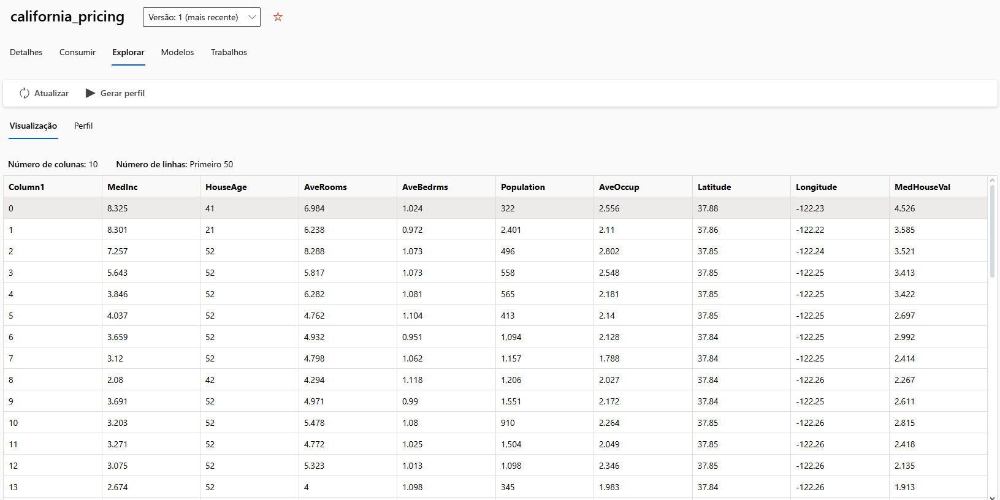
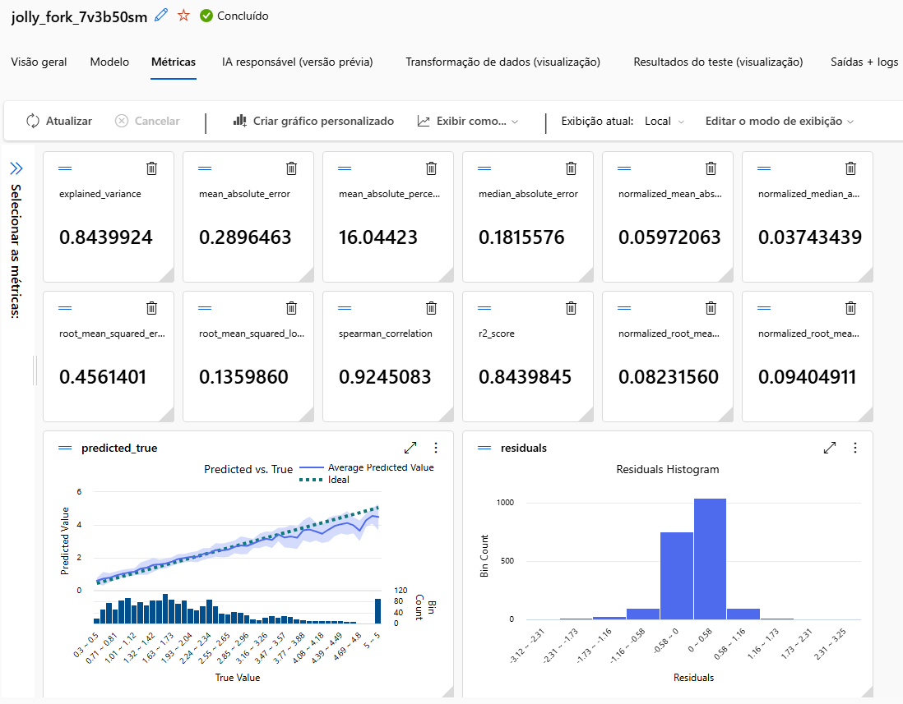

# Treinando Seu Primeiro Modelo de Machine Learning para Prever Vendas

Esse desafio em forma de exercício faz parte do Bootcamp DP100 - Azure Data Science Associate promovido pela DIO.

A idéia será abordar o básico do uso do Azure Machine Learning Studio através de uma proposta simples de previsão de vendas.

## Dataset

O dataset usado nesse experimento é o California Housing Prices, que apresenta registros de imóveis no estado da Califórnia, suas características em relação à area e seu valor de venda. O conjunto de dados se encontra disponível na internet ou pode ser encontrado extraindo da biblioteca Scikit-Learn.

## Treinamento e avaliação do modelo registrado
Como o problema abordado é estimativa de valor de venda, sabemos que a variável target se trata de um valor contínuo. Sendo assim, o direcionamento de treinamento para algoritmos de Regressão. O rol de modelos escolhidos foi limitado entre XGBoostRegressor e RandomForestRegressor, além de seus ensembles combinados pelo job. Foi escolhido o método de treino usando KFold com 5 folds para cada avaliação.

Aqui podemos observar que o modelo VotingEnsemble selecionado pelo job mostrou grande performance durante o treinamento. Uma boa variabilidade explicada do conjunto pelo modelo (r2), altissima taxa de correlação entre variavel dependente e suas features e baixa taxa de erros no geral.
A linha ideal de predição se aproximou muito dos valores previstos no treino, como mostra o gráfico a direita abaixo, dando uma leve distanciada nos valores ao final da série de amplitude do conjunto, o que coincide com a proporçãoa anormal de dados contendo essa faixa de valores.
Já a distribuição de resíduos (erros) no treinamento se mostrou próxima do normal.

